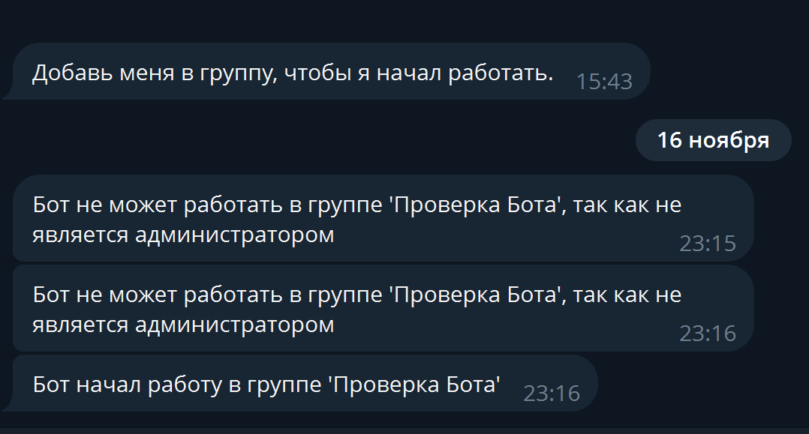
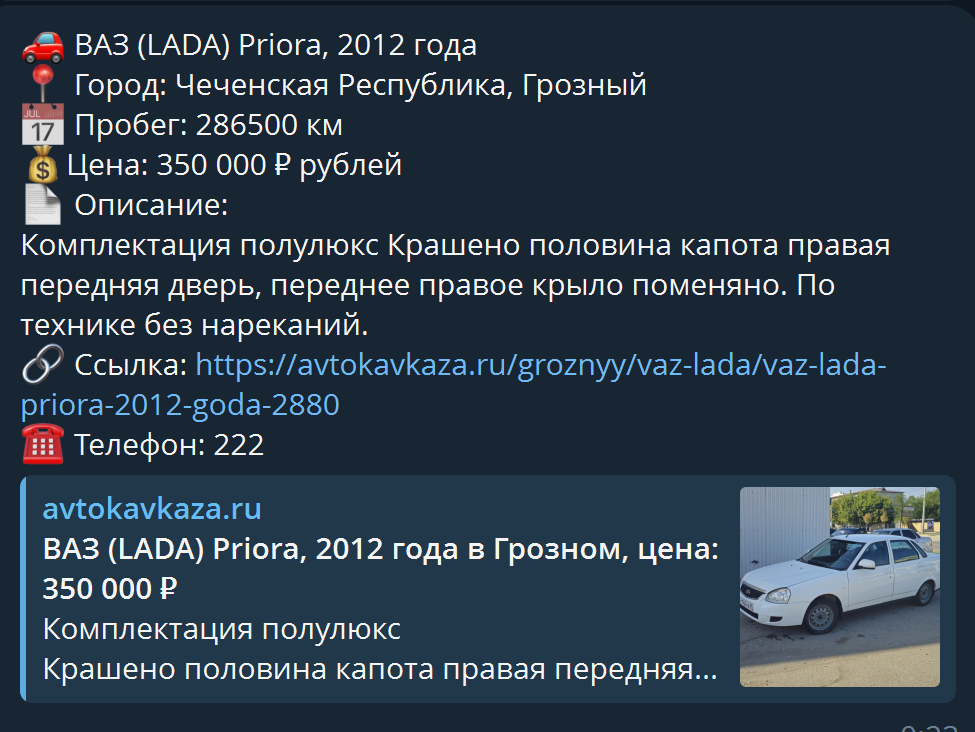

# Aiogram Telegram Bot - бот-парсер объявлений с сайта AutoKavkaz

Телеграм бот-парсер для рассылки актуальных объявлений в чаты.

## Описание проекта

Бот работает в режиме polling. Админ должен добавить бота в нужный чат и задать ему статус админа, чтобы бот начал работу. 

## Технологический стек

- [Python](https://www.python.org/)
- [Aiogram 3](https://docs.aiogram.dev/en/dev-3.x/)
- [SQLite3](https://www.sqlite.org/)
- [BeautifulSoup4](https://pypi.org/project/beautifulsoup4/)
- [Selenium](https://www.selenium.dev/)

## Реализованные функции

- Управлять ботом может только определенный пользователь
- Бот начинает работу только при выставлении статуса - админ
- Просмотр сайта каждые 10 минут и добавление свежих объявлений машин
- Отправка объявлений в чат каждые 20 минут

## Фото интерфейса

